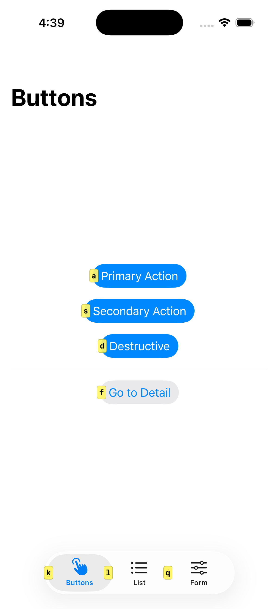

# Vimulator

Vimium-style keyboard navigation for iOS Simulator.



## Why not Vimac / Homerow?

macOS-level tools like Vimac and Homerow work via the Accessibility API over IPC — they live outside your app process, which introduces noticeable latency on every hint activation and scroll event.

Vimulator runs **inside your app process**. It talks directly to UIKit with no IPC overhead, so hint activation and scrolling respond within a single frame.

## Features

| Key | Action |
|-----|--------|
| `f` | Enter hint mode — labels appear on every interactive element |
| hint chars | Activate the matched element |
| `Escape` | Exit hint mode / dismiss keyboard |
| `j` / `k` | Scroll down / up |
| `h` / `l` | Scroll left / right |

Holding a scroll key scrolls continuously at 600 pt/sec.

## Requirements

- iOS 16+
- **Simulator only** — all code is guarded by `#if targetEnvironment(simulator)`

## Installation

### Swift Package Manager

```swift
dependencies: [
    .package(url: "https://github.com/takumatt/vimulator", from: "0.1.0")
]
```

## Usage

Call `Vimulator.shared.install()` once at app startup, after the key window is ready.

### SwiftUI

```swift
import SwiftUI
import Vimulator

@main
struct MyApp: App {
    init() {
        Vimulator.shared.install()
    }

    var body: some Scene {
        WindowGroup { ContentView() }
    }
}
```

### UIKit

```swift
import UIKit
import Vimulator

@main
class AppDelegate: UIResponder, UIApplicationDelegate {
    func application(
        _ application: UIApplication,
        didFinishLaunchingWithOptions launchOptions: [UIApplication.LaunchOptionsKey: Any]?
    ) -> Bool {
        Vimulator.shared.install()
        return true
    }
}
```

## Customization

Set properties before calling `install()`:

```swift
Vimulator.shared.style = .dark
Vimulator.shared.overlayEffect = .blur()
Vimulator.shared.appearAnimation = .fade(duration: 0.2)
Vimulator.shared.install()
```

### Hint label style

| Preset | Description |
|--------|-------------|
| `.vimium` | Classic yellow badge (default) |
| `.modern` | Frosted glass with large corner radius |
| `.simple` | Minimal outline-only badge |
| `.dark` | Dark badge for light-colored UIs |
| `.accent` | System tint color |

Or build your own:

```swift
Vimulator.shared.style = HintLabelStyle(
  backgroundColor: .systemPurple.withAlphaComponent(0.9),
  cornerRadius: 6,
  textColor: .white,
  matchedPrefixColor: .yellow,
  font: .monospacedSystemFont(ofSize: 12, weight: .bold),
  padding: 4
)
```

### Overlay effect

```swift
Vimulator.shared.overlayEffect = .none                          // default
Vimulator.shared.overlayEffect = .dim()                        // alpha 0.3
Vimulator.shared.overlayEffect = .dim(UIColor(white: 0, alpha: 0.5))
Vimulator.shared.overlayEffect = .blur()                       // opacity 0.7
Vimulator.shared.overlayEffect = .blur(style: .systemMaterial, opacity: 0.5)
```

### Appear animation

```swift
Vimulator.shared.appearAnimation = .none
Vimulator.shared.appearAnimation = .fade()           // 0.15s (default)
Vimulator.shared.appearAnimation = .fade(duration: 0.3)
```

## How it works

- **Keyboard monitoring** — swizzles `UIApplication.sendEvent` to intercept hardware key events globally
- **Hint mode** — walks the UIAccessibility tree to collect interactive elements, renders a transparent `UIWindow` overlay with hint labels
- **Activation** — calls `accessibilityActivate()` on the target element; falls back to `becomeFirstResponder()` for text inputs and `UIControl.sendActions` for controls
- **Scrolling** — uses `CADisplayLink` to move `contentOffset` at a fixed velocity per frame, with `adjustedContentInset`-aware clamping

## License

MIT
